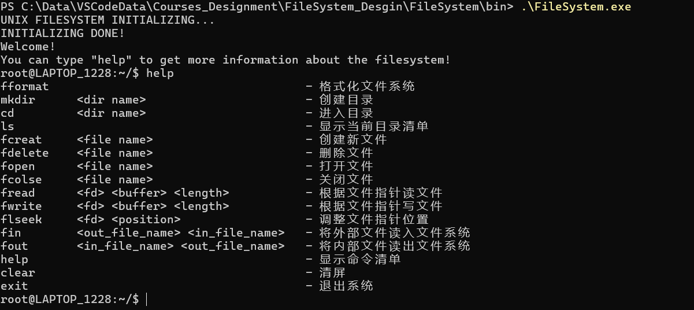

# FileSystem
## Overall Perview

## Enviroment Set
* 操作系统：Windows 11
* 编译器选项：g++ (GCC) 3.4.5 (mingw-vista special r3)（同UNIX V6++）
* 编辑器：VsCode
* 项目管理: makefile
* 调试工具：gdb
* 代码管理：github

注意，这里的编译器必须是32位编译器，如果使用最新的64位编译器，那么可能会出现难以预料的错误。

## Use
* 直接点击已有的exe文件进入运行
* `make`命令重新生成exe文件进入运行已有的exe文件中目录结构已经创建完成，如果通过`make`重新生成或进行手动`format`命令，那么文件目录结构则为空。
* 正常退出程序使用`exit`命令